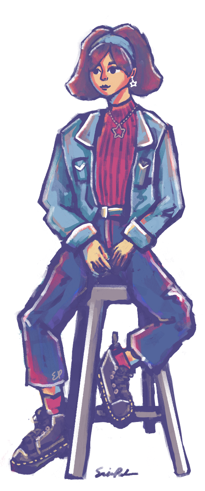

  
Hello, I’m Erin, an undergraduate computer science student at Northwestern University aiming to get the Segal Design Certificate. 

My main interests are in user-focused design, such as front-end development, UI/UX design, etc. I also have a [game design hobby](/tags/game-dev/), due to enjoying creation of art, writing, and coding. 

I'm from Seattle, unless you're from Seattle, in which case I am actually from half an hour away. 

I'm involved with [Northwestern Formula Racing](https://northwesternformularacing.com/) (in the aerodynamics subteam, despite being a CS major). 
