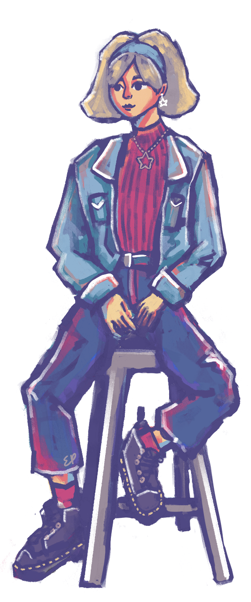

  
Hi, I'm Erin, an undergrad at Northwestern University working on getting a BS in Computer Science. My interests mainly lie in user-centered creation, such as UI/UX and game design. 

I'm currently a sophomore undergrad at Northwestern University majoring in Computer Science and aiming to get the Segal Design Certificate. I'm from Seattle, unless you're from Seattle, in which case I am actually from half an hour away. 

I'm involved with [Northwestern Formula Racing](https://northwesternformularacing.com/) (in the aerodynamics subteam, despite being a CS major).

I once used to write, and I once used to draw. That, and my cs-degree-in-progress has resulted in my current interest being game design. 

