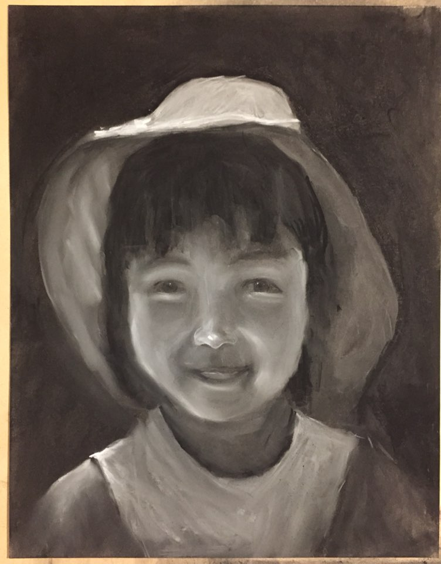
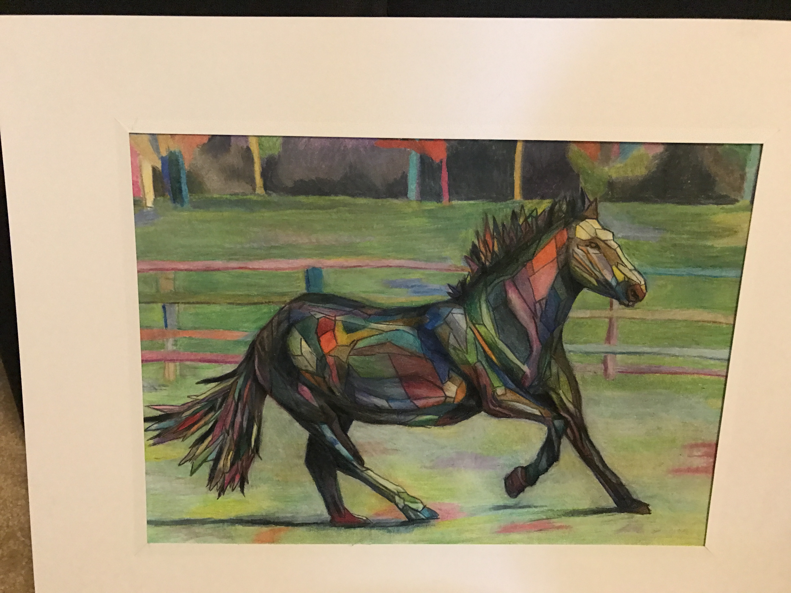
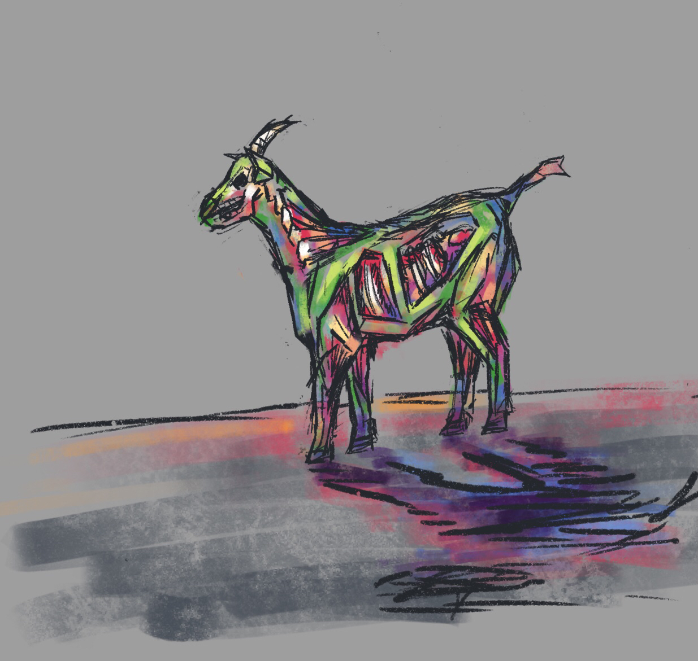
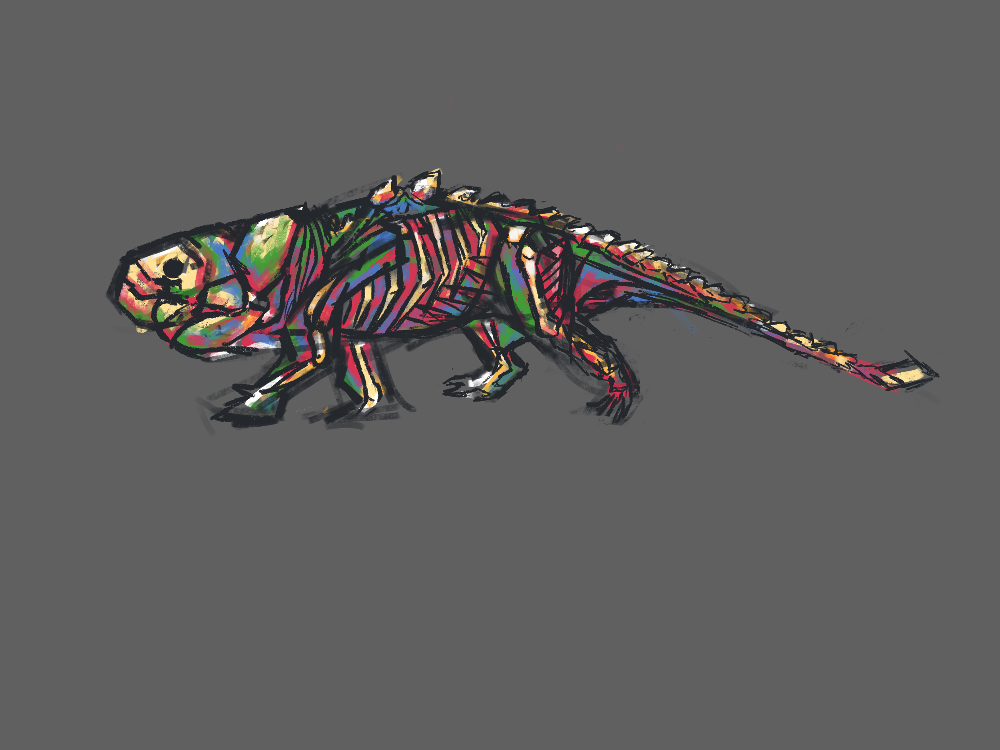
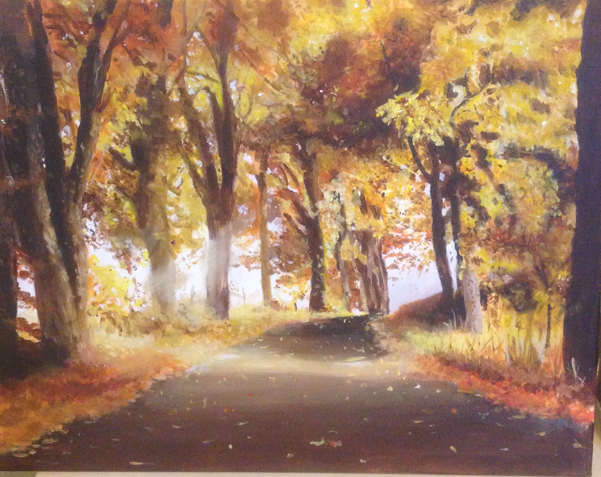
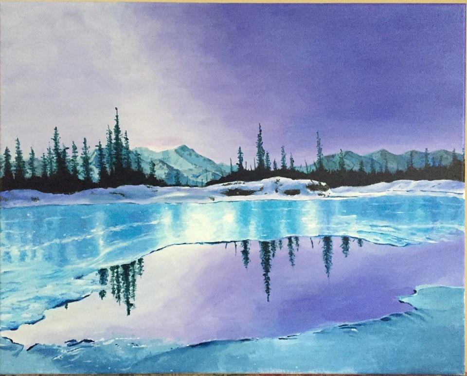
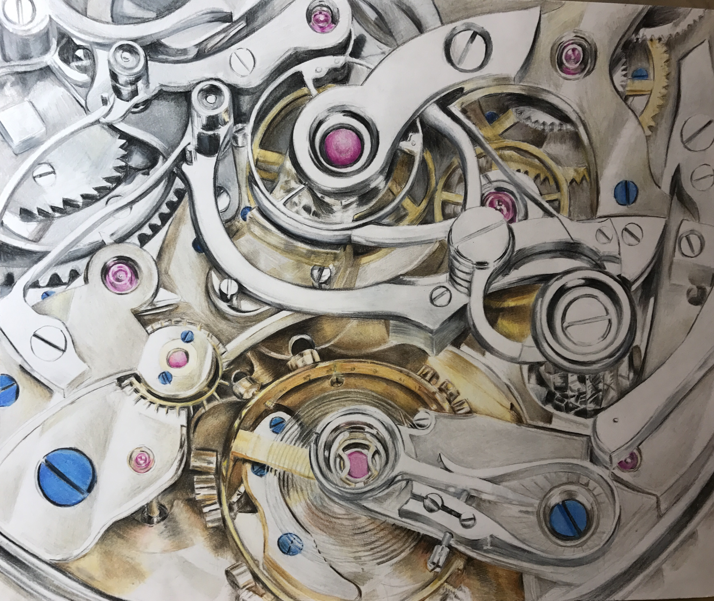
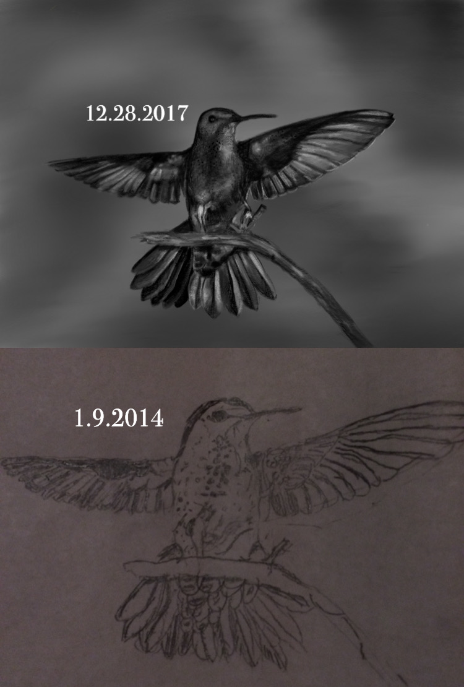
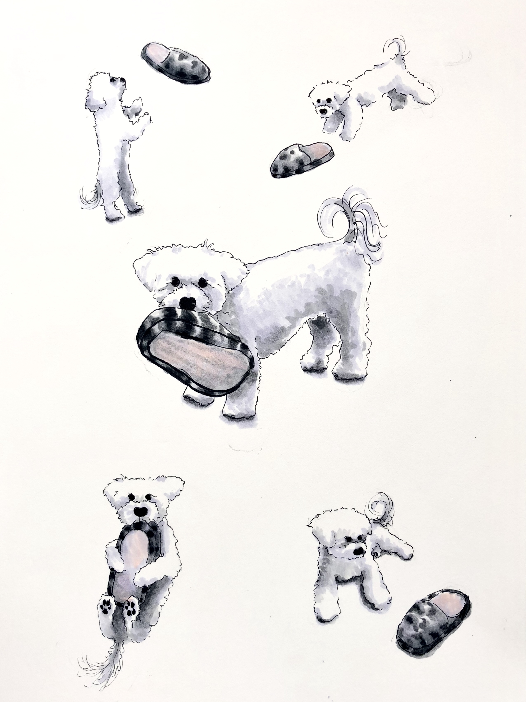

I probably started art, if you can say that, around the time most people do, in elementary school or so, drawing crude impressions of subjects that you like (I only drew cats, flowers, birds, and trees). I didn't really start taking it seriously until around 2014, when I was 12. 

Me, <i>Younger Self Portrait</i> (Or whatever I named it at the time), 2014, charcoal on paper.

It's the first art piece I won an award for, a couple months 
after I started taking lessons. I got a [Scholastic Art and Writing](https://www.artandwriting.org/awards/recognition/) Gold Key for it. Looking back, what really carried me in getting the award was that I was 12. It's not a very technically good piece, especially compared to what I did later. But it was a nice start and a good boost for my confidence. 

## 2015

Now that I think about it, I'm unsure about everything else from this year (which is why none of it is posted), but the horse was pretty cool. I did similar doodles years later. Sadly I don't have a better picture of the horse. 

Here are the 2021 doodles. A bit of a sneak peek time-wise. Kind of similar, except that I doodled these in 30 minutes in 2021 while watching TV instead of spending hours and hours doing and redoing the horse in 2015. I've always liked colors. 

## 2016
Ah yes. This was a pretty good year. 

I doodled the blue lake landscape at least twenty times on notebooks that year. I can still scribble it out within a minute when asked. I did prefer the blue landscape at the time, but now I can tell that the fall one was much better technically. 

## 2017

Here's a redraw of a bird I drew before I started taking art lessons. Around 4 years apart. I'm pretty sure I did this because I saw some kind of Instagram/Twitter trend and I thought it was cool. Some improvement was done. 

## 2018

Some copic marker drawings I did of my dog. 

This one was definitely my highest-invested drawing ever. That's why I've made it bigger than the other ones. I'm pretty sure that I did half of this during the week I was 'studying for finals'. Quite a contrast from my more stylized dog drawings right before this. 

Funnily enough, this is about when I started being interested in a STEM related career. I did too much math for this one drawing. 

## 2019
This is when I put together a portfolio for the sake of IB Art, and because I thought it might help me get into college. Northwestern didn't even let me submit an art portfolio. Granted, I also didn't think they would do anything other than reject me, so I was already aiming the portfolio at other places when I got that acceptance. 

WIP - There are a lot of pictures for me to post here and to explain. Lots of fun work. s

## 2020 and beyond

WIP - Have some stuff I'd like to put here but need to hunt pictures down