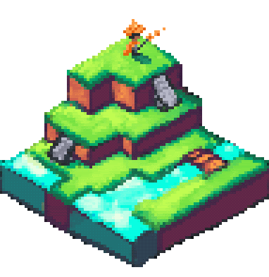

## 

**Role:** Engineer & Designer

**Timeline:** 10 weeks from 4/1/21 - 6/9/21

**Tools:** RPGmaker MZ, Procreate

**Teammate(s):** June Hooper, Gabriel Villaroel Narvaez, Natalie Norquist

ChemQuest is a demo of a chemistry-inspired RPG game sponsored by the Design Thinking and Communication Program. Its site is [here](https://sites.google.com/u.northwestern.edu/chemquest/home).

I worked with four other freshman undergraduate engineering students to create a product for our client, 
Dr. Mitra Hartmann (also from NU). We had a pretty good time, especially when we were able to conduct
research by playing Paper Mario and use $80 of our budget on RPGmaker MZ. 

The site has most of the relevant information about the process and research, but I'll include part of the executive summary here because I think it summed it up pretty well. 

> Learning chemistry can be a daunting task. The first exposure that many students receive to the subject is in confusing, non-intuitive high school classes. This initial experience often causes students to form negative attitudes and turn away from chemistry permanently...Ultimately, our challenge was to create a game that introduces elementary and middle school students to fundamental chemistry concepts and prompts interest in learning through engaging gameplay mechanics. 

> We approached our task from a user-centered perspective, aiming to create a game that appealed to students with little familiarity with chemistry and video game... We also conducted multiple rounds of testing with three mockups to identify the game med ium (i.e. board games, card games, video games) that most effectively engaged our users. 

> Our final design is a role-playing virtual game called ChemQuest, which was created using the game engine RPG Maker MZ. The design has four main components: (1) A narrative plot-line, (2) accessible aesthetic design, (3) a turn-based RPG battle system, (4) an interactive chemistry-themed world. The design primarily utilizes indirect chemistry, as students are exposed to the names of common molecules, periodic groups and their properties, and other chemistry-related vocabulary terms. The narrative plot-line and interactive world provide a clear sense of progression for the users, which keeps the students engaged with the game. This engagement also leads to a positive association with the subject of chemistry. As a role-playing game, ChemQuest encourages the player to identify with their chosen character, and the game's accessible design allows for users of all backgrounds to feel represented. Aesthetically pleasing graphics keep the game fresh and exciting for students as they progress through the game. The game interface is also easily customizable, which supports children of differing abilities. Finally, the turn-based battle system subtly encourages users to practice their chemistry knowledge, as students must draw upon their understanding of periodic groups to defeat science-themed enemies in fantastical battles. Ultimately, ChemQuest is carefully imbued with chemistry content to produce an immersive, engaging learning experience.

### Art for the game. 
Here's the art dump.

	

I made this thing in 15 minutes in Procreate. Exported the gif incorrectly, so now I only have this low quality version because I lost the original files. 

Characters were based upon an open-source RPGmaker character generator that I have currently forgotten the name of, and then edited for consistency. I went about making these characters by going around and asking my friends what RPG class & color they wanted after giving them some options.

These are some character dialogue portraits. The bottom left one is somewhat based upon myself, and fruit hat guy is another one of the other team members in the group that created this. The other two are likenesses of personal friends (with permission).

I made a character sheet off of my favorite portrait. Never got to present this, but thought it was a cool concept. 

Here are the villains, Deniz the Menace & Francesco. You can play as them too if you want. Evil is just a matter of perspective. Also did these portraits in Procreate.

Concept art & final art of the items that dropped from monsters. Procreate again.
				
Overall, cool project. Cool teammates. 10/10 would play again. And now, time to make more games. 
				

				

					

