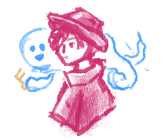
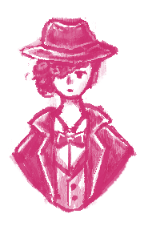

This project is a 2D puzzle platformer set in a city styled after the roaring twenties filled with photophobic ghosts. You play as a young woman who uses light to interact with ghosts and navigate the city to turn on electric generators & restore power.

Role      | Timeline | Tools  |  Team   |
| --------  | -------- | ------ | ------- |
| Designer, Artist | Project started on 10/11/2021 | Unity, C#, Aseprite| too many to list off the top of my head      |

### 12/18/21: Art Dump

					
Artistic inspirations include: noir detectives, victorian women's updo hairstyles, and 1920s suits. 

