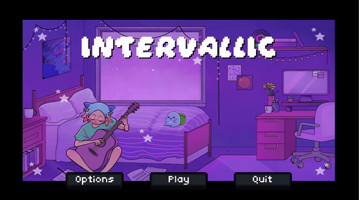

I previously did visual design & project management for it.

Accomplices include Aspen Buckingham, Mercedes Sandu, Steven Jiang, and Jack Burkhardt.

Check it out at [overture.games](https://www.overture.games).

Jack also did a nice writeup on [his own site](https://jackburkhardt.com/projects/intervallic/).