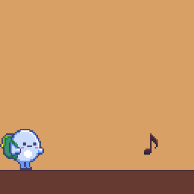
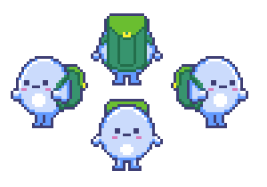
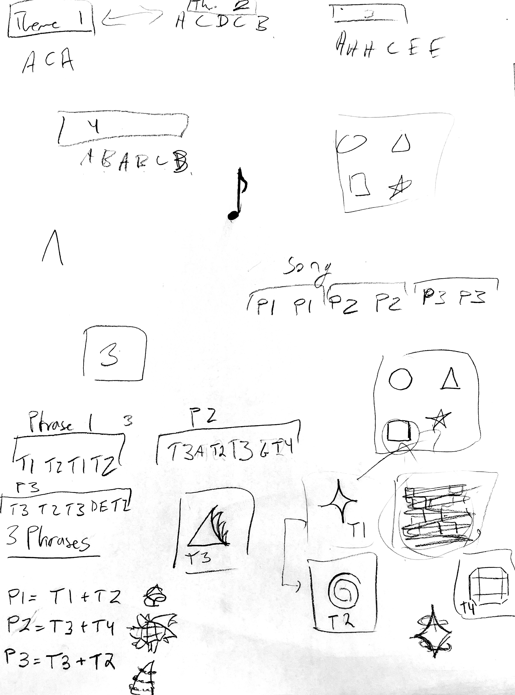
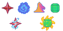

This project was a 5 hr game jam project with 5 members, including myself and Aspen, who I am currently working on Overture Games with (partially as a result of this game jam). The game jam was hosted by NU's PIE organization.

Aspen had a really nice design document that I will be blatantly stealing from here. Assume that there are implied citations to it. 

Controls: Keyboard & mouse controls () 
Aesthetics: Cute, Exploration, Sensation, Challenge, Learning
Players: 1

# Gameplay
> As Songly traverses the board they collect musical objects and put them in their backpack. The backpack can fit five objects. The musical objects spawn randomly on the game board based on the level and goal. If Songly collects all of the objects in the correct order based on the goal and presses spacebar the music of the goal plays and then they win that level. 

I did some visual design stuff with matching animation to 2D movement control in Unity, and some unity animator stuff. 

**Songly basic walk & collect note animation**

The way that we formatted this was that the player collects notes, which turn into motifs, which become themes, which eventually leads to the player doing an entire song after they collect everything. 

**Sketches for theme sprites**

**Actual theme sprites**

NOTE: I will upload a basic gameplay video when I get around to it.

